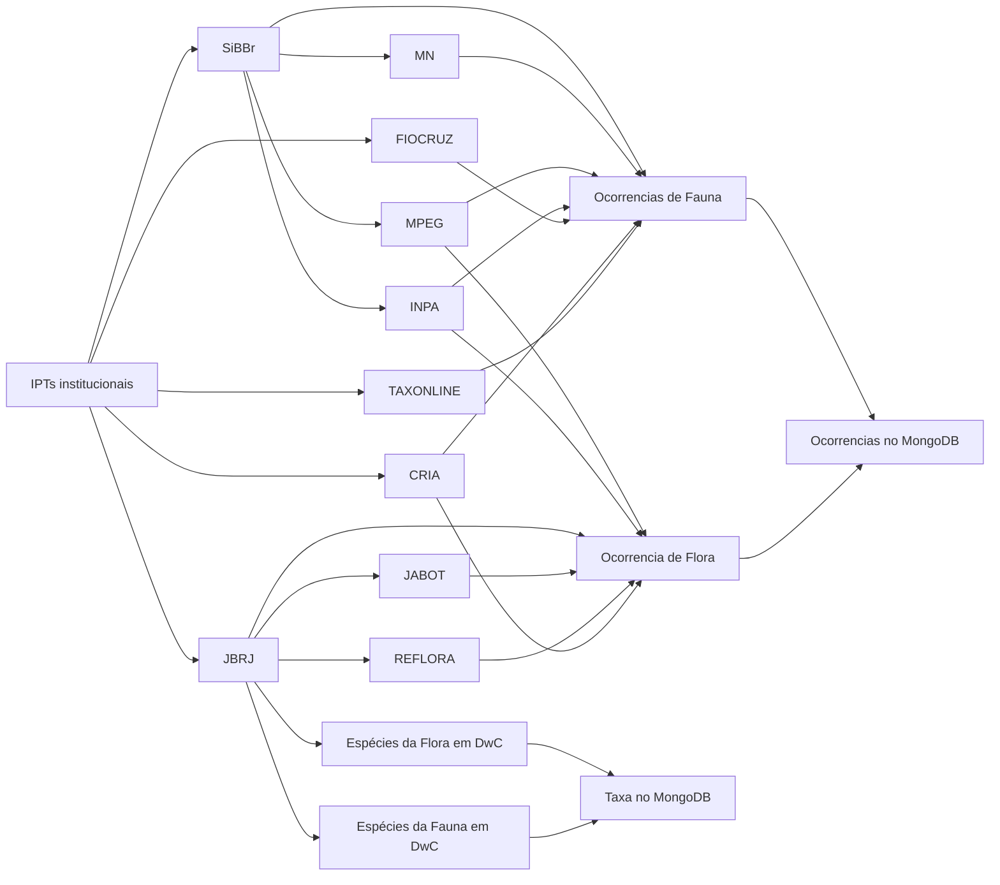

# Base de Dados Integrada da Biodiversidade Brasileira
[Eduardo Dalcin](https://github.com/edalcin) e [Henrique Pinheiro](https://github.com/Phenome)

## Histórico do Projeto

Este projeto iniciou com a proposta de converter dados de ocorrência e de lista de espécies no formato [Darwin Core (DwC)](), disponíveis nos [IPTs] de diferentes instituições nacionais, para o formato [JSON]() e carregar os dados em um banco de dados [MongoDB](). A motivação para o projeto era a de facilitar o acesso aos dados, transformando-os de um formato de tabelas relacionadas, no [DwC Archive](), para um formato de documentos JSON, armazenados em um banco de dados orientado a documentos, como o MongoDB.

