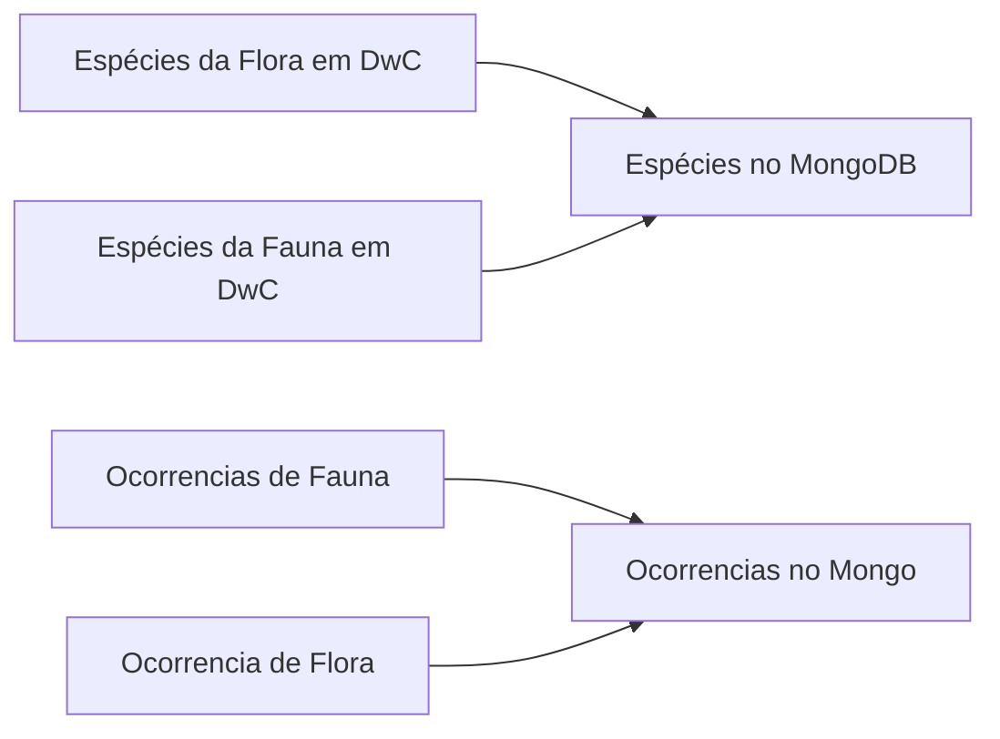

# Visualização de Dados sobre Biodiversidade Brasileira

```mermaid
flowchart LR
    1[Espécies da Flora em DwC] --> A[Espécies no MongoDB]
    2[Espécies da Fauna em DwC] --> A
    3[Ocorrencias de Fauna] --> B[Ocorrencias no Mongo]
    4[Ocorrencia de Flora] --> B

```