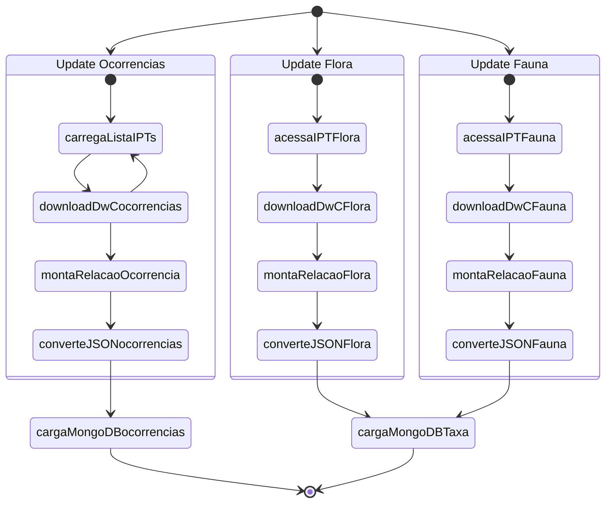

# "Actions" de atualização da base de dados

```mermaid

stateDiagram-v2
    [*] --> Updatefauna
    Updatefauna: Update Fauna
    state Updatefauna {
    [*] --> acessaIPTFauna
    acessaIPTFauna --> downloadDwCFauna
    downloadDwCFauna --> montaRelacaoFauna
    montaRelacaoFauna --> converteJSONFauna
  
    }
    [*] --> Updateflora
    Updateflora: Update Flora
    state Updateflora {
    [*] --> acessaIPTFlora
    acessaIPTFlora --> downloadDwCFlora
    downloadDwCFlora --> montaRelacaoFlora
    montaRelacaoFlora --> converteJSONFlora
   
    }
    [*] --> Updateocorrencias
    Updateocorrencias: Update Ocorrencias
    state Updateocorrencias {
    [*] --> carregaListaIPTs
    carregaListaIPTs --> downloadDwCocorrencias
    downloadDwCocorrencias --> carregaListaIPTs
    downloadDwCocorrencias --> montaRelacaoOcorrencia
    montaRelacaoOcorrencia --> converteJSONocorrencias
    }

    converteJSONFlora --> cargaMongoDBTaxa
    converteJSONFauna --> cargaMongoDBTaxa
    converteJSONocorrencias --> cargaMongoDBocorrencias
    cargaMongoDBocorrencias --> [*]
    cargaMongoDBTaxa --> [*]    
```