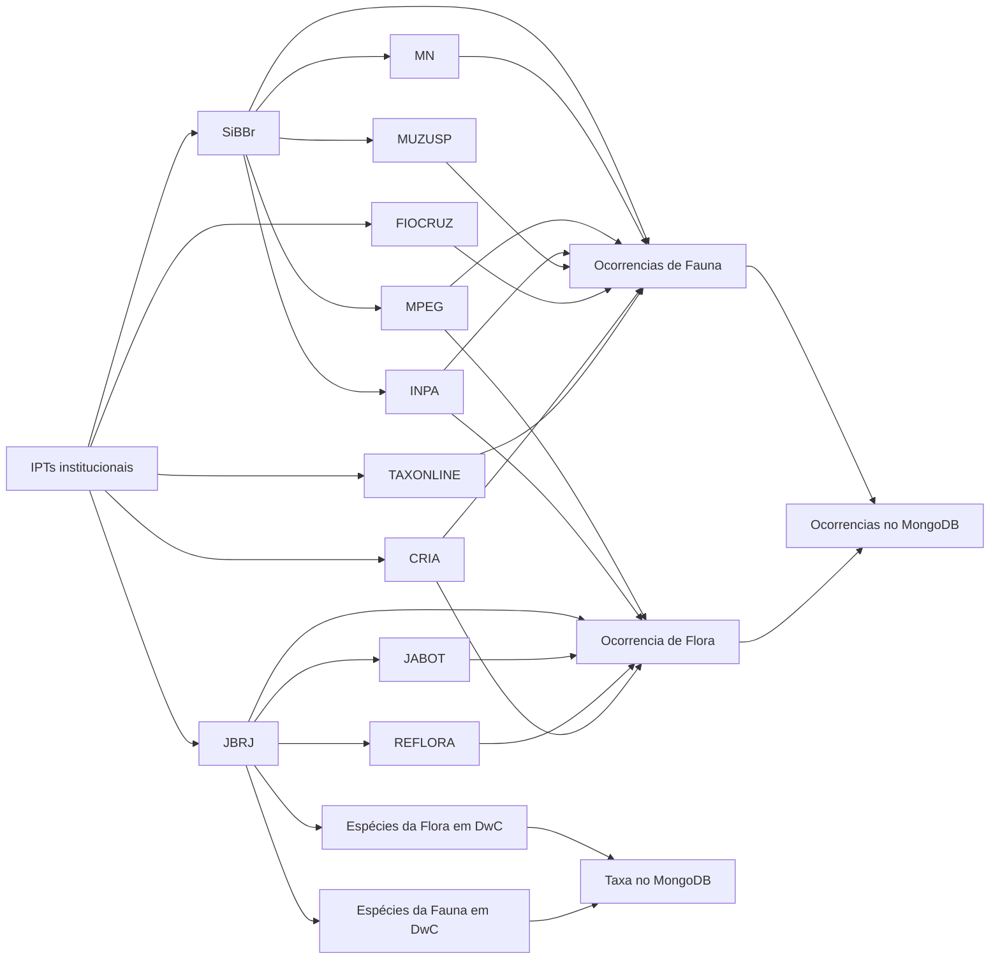

```mermaid
flowchart LR
    0[IPTs institucionais] --> 1[SiBBr]
    
    0 --> 2[JBRJ]
    2 --> 3[JABOT]
    2 --> 4[REFLORA]
    0 --> 5[FIOCRUZ]
    0 --> 6[CRIA]
    0 --> 7[TAXONLINE]
    1 --> 11[MN]
    1 --> 12[MPEG]
    1 --> 13[INPA]
    1 --> 14[MUZUSP]
    1 --> C

    11 --> C
    12 --> C
    12 --> D
    13 --> D
    13 --> C
    14 --> C
    2 --> A
    2 --> B
    2 --> D
    3 --> D
    4 --> D
    5 --> C
    6 --> C
    6 --> D
    7 --> C

    A[Espécies da Flora em DwC] --> A1[Taxa no MongoDB]
    B[Espécies da Fauna em DwC] --> A1
    C[Ocorrencias de Fauna] --> C1[Ocorrencias no MongoDB]
    D[Ocorrencia de Flora] --> C1
```